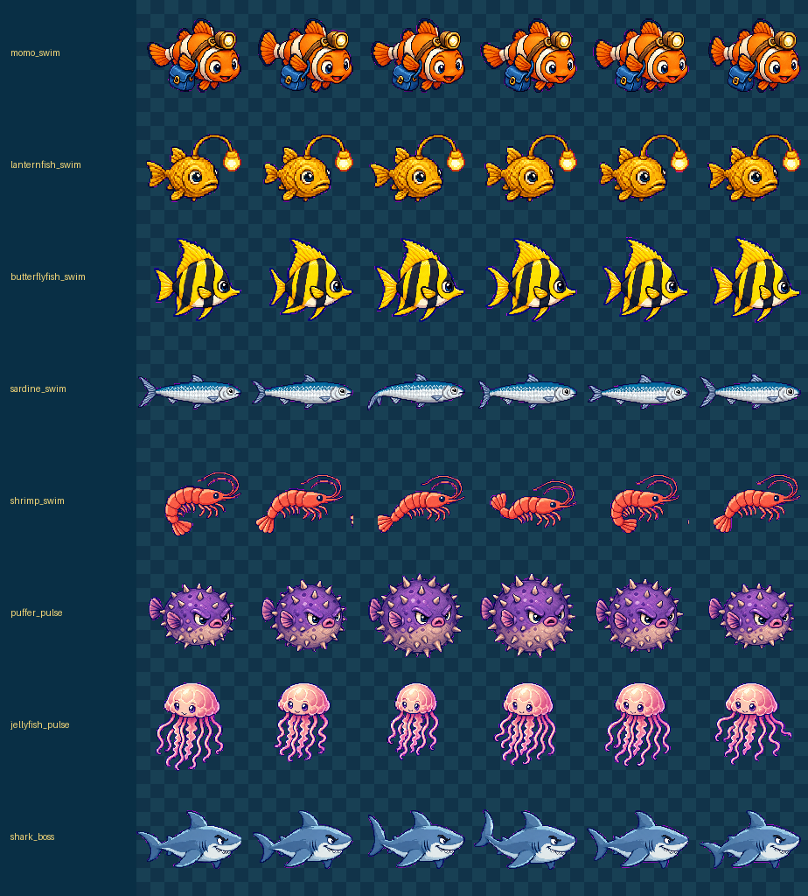
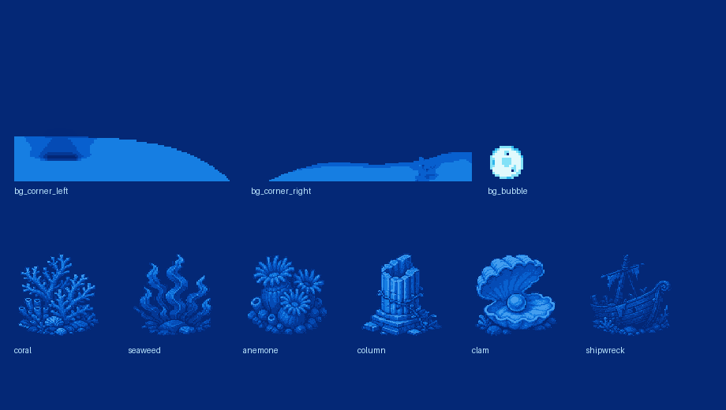
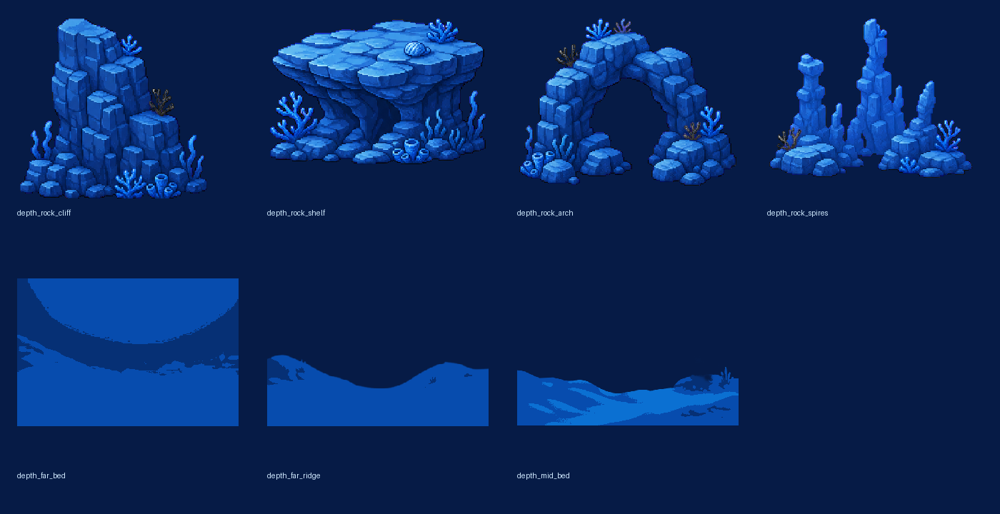
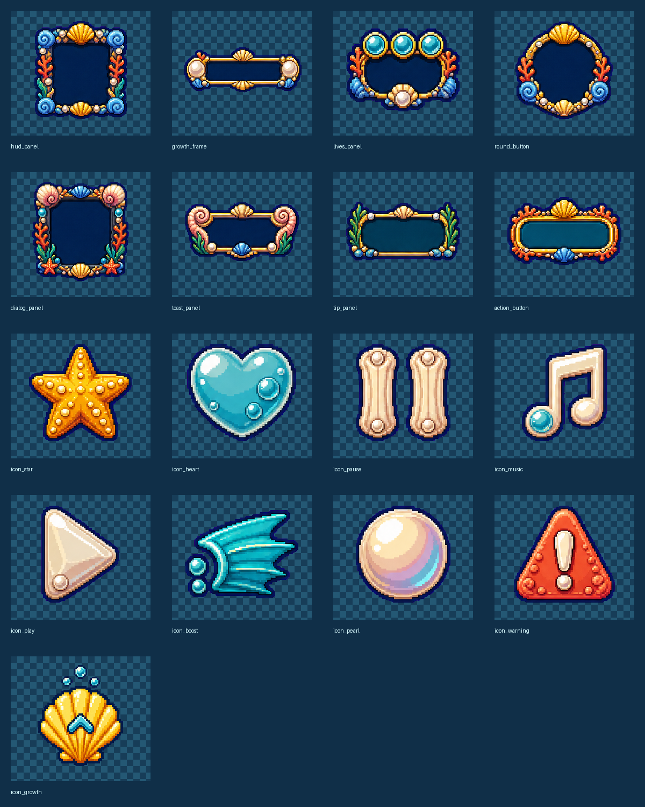

# 沫沫的珊瑚午餐

一款可直接部署到 GitHub Pages 的横版等距像素风海底成长小游戏。玩家控制戴着探照灯的小丑鱼“沫沫”，追逐会闪躲的鱼虾，长大后反击刺豚、水母，并在每片海域结尾挑战鲨鱼王。

## 实验目的

这个项目也是一次模型“全自主制作循环”能力测试：从一条完整 Prompt 出发，让模型自主完成概念设计、生图、切图与透明处理、素材验证、游戏开发、浏览器运行、视觉与交互检查、自动修复、离线构建和文档整理。保留 `prompts/`、`workflow/sources/`、`workflow/tools/` 与 `workflow/reports/`，是为了让过程可以复现和审查，而不只是保存最终游戏。

未来模型能力升级后，可以在干净目录中再次运行同一份 [`prompts/00-one-shot.md`](prompts/00-one-shot.md)，并使用相同的关卡流程、响应式尺寸、素材验证指标和浏览器 QA 做横向比较。建议记录模型版本、运行日期、环境、人工追加指令次数、完成用时、自动修复轮数和最终限制，以观察模型在美术一致性、动态 UI、动画稳定性、玩法完整度与自主收敛能力上的变化。

## 运行与部署

- 直接运行：双击 `index.html`，或将它拖入浏览器打开；游戏不需要安装依赖或执行构建。
- 兼容方式：如果浏览器限制 `file://` 下的本地音视频，可使用任意静态服务器。例如执行 `python3 -m http.server 8765`，再打开 `http://127.0.0.1:8765/`；Python 不是必需依赖。
- GitHub Pages：将仓库推送到 GitHub，在 Settings → Pages 中选择从默认分支根目录部署。
- 页面运行时不访问外网；图片、视频、BGM 和音效都从本地 `assets/` 加载。

## 玩法

- 鼠标 / 触控：移动目标；按住鼠标或手指冲刺。
- 键盘：方向键或 WASD 移动，按住 Shift 冲刺。
- 水族馆观赏模式：开始游戏后点击右上角 HUD 中的眼睛按钮。沫沫会自动觅食、躲避危险、挑战鲨鱼并循环巡游三片海域；追逐时会预判猎物路线，并根据距离、逃逸速度和屏幕边缘动态切换巡游、追逐与强力冲刺三档速度。
- 观赏时点击画面或按方向键 / WASD 可随时接管；再次点击 HUD 中的观赏按钮即可恢复自动游玩。
- 小鱼会感知玩家并转向闪躲；冲刺会留下泡泡和水流尾迹。
- 体型按画面中的实际大小判断碰撞结果，避免“看起来已经更大却仍然受伤”。
- 成长到 100% 后进入无敌进食阶段，仍可继续长到 180%；玩家自行击败鲨鱼王后再选择进入下一海域。
- 三片海域具有不同的水流速度、物种密度、危险组合、地貌与色调；鲨鱼王每关都会出现。

## 美术方向

统一方向为“可爱、明亮轮廓、深海蓝环境、等距偏侧视、手绘像素颗粒”。前景生物保留暖色识别度，再通过运行时的水下去饱和、青蓝 screen tint、深度亮度和聚光灯统一进海水氛围。场景采用远景海床、中景石拱与尖塔、前景岩壁三层视差，叠加本地水面焦散视频与 CSS 静态焦散后备层。

UI 最终采用 Glass + Water 混合方案，而不是把整张像素框拉伸成容器：自适应圆润 CSS 玻璃层负责文字、动态宽度和响应式布局，17 个独立透明像素素材负责生命、成长、声音、观赏、冲刺等识别与装饰；只有主对话框保留经过多尺寸检查的像素 `border-image`。这样既保持海水玻璃的轻盈层次，也避开早期整套切图框出现的拉伸、文字错位、黑边和 padding 不稳定。

## Prompt 文档

完整复现入口是仓库根目录的 [`PROMPT.md`](PROMPT.md)；同一内容也保留在模块目录的 [`prompts/00-one-shot.md`](prompts/00-one-shot.md)，便于与其余专项 Prompt 一起维护。README 不重复粘贴 Prompt 正文。

- [`PROMPT.md`](PROMPT.md)：用户只需复制这一份，即可从空目录完整制作、或接管已有项目继续自动检查和修复。
- [`prompts/README.md`](prompts/README.md)：Prompt 索引，可按需选择汇总制作与修复、核心玩法、观赏 AI、角色动画、场景景深、UI 字体、音频反馈、素材流水线、构建部署、浏览器 QA 或文档维护。

`00-one-shot.md` 适合完整制作或接管；其余编号模块适合只重做或验收某一部分。每份模块文档都是一条可独立复制执行的 Prompt，并要求直接实现、检查、修复和回归。

## 自动化素材流程

```text
确定像素美术方向
→ 生成 3×2 角色表、4×4 UI atlas 与独立成长图标
→ 色键透明化 / 去溢色
→ 连通域清理和独立裁切
→ 最近邻缩放到 256×256 帧
→ 按头部、身体中心或水母钟体注册锚点
→ 合成横向运行时 spritesheet
→ 检查透明角、边缘截断、色键残留、覆盖率和锚点误差
→ 生成 contact sheet 肉眼复核
→ 构建 Pages 目录与全内嵌 HTML
→ 浏览器运行、交互、响应式和媒体加载检查
```

归档工具位于 `workflow/tools/`：

- `process_animation_sheets.py`：调用 chroma-key helper，清理小碎片，裁切六帧，用最近邻缩放并注册动画锚点。
- `process_ui_atlas.py`：切分 4×4 UI 图集，并处理独立成长图标；移除色键、按连通域排除邻格粘连，输出 17 个透明素材和验证表。
- `slice_ui_frames.py`：生成传统三切片 / 九切片实验素材；最终界面仅保留对话框 `border-image`，避免整套框体在不同文字宽度下变形。
- `build_reef_feast.py`：生成独立资源 Pages 版本和全内嵌单 HTML 版本。

生成原图保存在 `workflow/sources/`，检查结果与 contact sheet 保存在 `workflow/reports/`。

## 素材检查与自动修复结果

- 动画：8 张 spritesheet、48 帧通过现有自动检查；透明角、边缘截断和锚点指标正常，最大锚点误差 0.5 px。但后续肉眼检查发现当前阈值仍会漏掉部分近似紫色背景残留，且鲨鱼放到较大尺寸时有效分辨率不足，因此不能把现有报告理解为最终视觉质量已经完全通过。
- UI：17 个独立透明素材全部通过；包含 4×4 atlas 的 16 个基础素材和单独生成的成长图标，无色键残留、无裁切触边。
- 修复过的动画问题：逐帧主体抖动、鱼鳍/触手贴边、灯笼鱼与主角灯光锚点偏移。
- 修复过的视觉问题：首关过亮、鱼贴图不融入海水、场景缺少景深、水面焦散不明显、聚光灯靠近光标时消失、光束边缘过硬。
- 修复过的 UI 问题：整张框体拉伸、文字与框不对齐、移动端裁切、按钮 hover 露出方形底图、对话框装饰外出现黑边。
- 修复过的逻辑与反馈问题：视觉尺寸与碰撞阈值不一致、100% 立即结束、每关缺少鲨鱼、猎物不会闪躲、冲刺反馈过硬、吃鱼和受伤反馈不明显。

### 已知素材限制与后续优化

- 大型主体需要独立分辨率预算：根据鲨鱼在游戏中的最大绘制尺寸、成长倍率和目标 DPR 生成更大的源图/单帧或高分辨率变体，不能继续把普通鱼与鲨鱼统一处理成相同的 256 px 帧后再放大。
- 色键清理需要从“精确 `#ff00ff` 匹配”升级为“背景连通的颜色容差 + 半透明边缘去色”。这样既能清除抗锯齿或生图产生的近似紫色，又不会全局误删刺豚、水母等主体本身的紫色/粉色细节。
- 如果重新生图和本地 mask/去溢色脚本仍无法正确处理复杂鳍、触须、半透明水母或紫色污染，可以使用可免费访问的在线 AI remove-background 工具作为 fallback。处理结果必须下载并保存在项目内，记录工具、链接、日期和许可/条款，并与原图对照检查细节是否被误删；外部服务不作为游戏运行时或构建时依赖。
- 验收报告应增加源尺寸、最大运行时尺寸、目标 DPR、放大倍率、近似紫色残留数量和半透明边缘溢色，并在深蓝、白色、高饱和对比底及游戏内最大尺寸下进行肉眼复核。

### 当前能力边界与未来动画路线

本次实验使用的 Codex 环境没有可直接调用的视频生成能力，因此八组角色动画由 ImageGen 直接生成 3×2 sprite sheet，再经过切片、去背和锚点对齐。这个方法可以完成基础六帧动画，但独立图片帧在复杂动作、形体连续性和时间节奏上仍有上限。

未来如果模型或工具具备可靠的视频生成能力，可以先为每个角色生成固定镜头、固定朝向、纯色背景的短循环视频，再按固定时间间隔抽帧，执行背景移除、像素化、统一画布、锚点对齐和 spritesheet 合成。视频天然包含连续运动信息，通常能得到更流畅的摆尾、转向、鼓起和触手动作，也能支持比直接生成六张图片更灵活复杂的动画。

视频路线仍不是自动通过：必须检查循环首尾是否衔接、角色与装备是否漂移、镜头是否移动、运动模糊是否破坏像素边缘，以及抽帧后的身份和比例是否一致。未来模型升级后的复现实验，可以使用同一份 `00-one-shot.md` 对比“ImageGen 直接出帧”和“视频生成后抽帧”两条路线。

### 动画 contact sheet

8 组角色动画、每组六帧；用于检查轮廓完整性、透明边缘、帧间形变与锚点稳定性。



### 场景 contact sheet

前景转角、气泡、珊瑚、海草、海葵、石柱、贝壳与沉船等可组合场景切片。



### 景深 contact sheet

远景海床、中景海床与岩壁、岩架、石拱、尖塔，用于三层视差与前景遮挡。



### UI contact sheet

4×4 UI atlas 的 16 个透明切片，加上单独生成的成长图标，共 17 项；检查装饰框、按钮、语义图标的裁切边界和色键残留。



## 音频与许可

运行时采用本地 CC0 素材，完整清单位于 `assets/audio/CREDITS.md`：

- [Underwater Ambient Pad](https://opengameart.org/content/underwater-ambient-pad)
- [Frenzied Swimming](https://opengameart.org/content/frenzied-swimming)（当前三关优先采用这首）
- [Pop sounds](https://opengameart.org/content/pop-sounds-0)（可爱吃鱼音效）
- [bubbles “pop”](https://opengameart.org/content/bubbles-pop)（水母泡泡）
- [Player Hit (damage)](https://opengameart.org/content/player-hit-damage)（受伤反馈）

### 参考与素材选择方法

- 场景氛围参考用户提供的 Momoyu V1/V2 海底素材与水面光影视频，提取其深蓝分层、焦散、气泡和前后景构图规律；运行时使用的鱼类、岩石、遗迹和 UI 均重新生成、切分或像素化处理，没有把参考合集整张贴进游戏。
- 景深设计参考经典“大鱼吃小鱼”游戏的可读性原则：远景山脊低对比，中景石拱建立尺度，前景岩壁遮挡画面边缘，再用视差、深度明暗和水下色调把角色压进环境。
- BGM 与 SFX 以“可本地下载、CC0、许可页清楚、与事件语义匹配”为筛选条件在 OpenGameArt 检索；下载后逐个试听，淘汰振荡器感过强、像枪声或过于刺耳的采样，再统一放入 `assets/audio/`。游戏运行时没有外链依赖，精确作者、来源与许可见 `assets/audio/CREDITS.md`。

## 宣传片制作

宣传片使用游戏中的独立透明素材重新编排为六幕动画，包含追逐成长、危险生物、100% 反击、三片海域与片尾 CTA，并配有中文女声旁白、游戏音乐和动作音效。

制作核心文档：[`DESIGN.md`](trailer/DESIGN.md) · [`SCRIPT.md`](trailer/SCRIPT.md) · [`STORYBOARD.md`](trailer/STORYBOARD.md)

## 技术说明

游戏使用原生 HTML、CSS、Canvas 2D 和 JavaScript，无框架、无构建时网络依赖。运行时启用 `imageSmoothingEnabled = false` 保持像素清晰；玩家坐标不再逐帧取整，只有绘制时像素对齐，从而避免移动抖动。鱼体俯仰采用指数阻尼并限制在约 ±8.6°，头灯锚点与光束起点使用同一个旋转矩阵，因此上下游动、左右翻转和键盘操作时不会错位。
